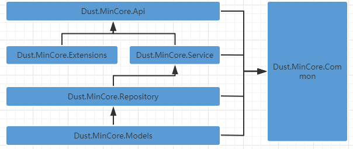
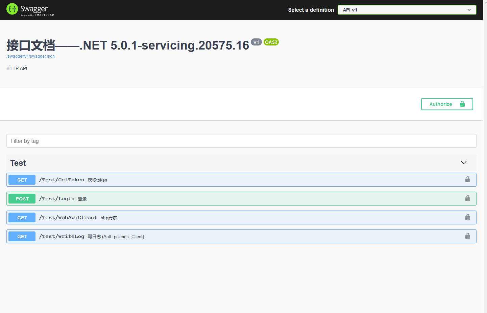

# Dust.MinCore

搭建了一个小型 WebApi 框架,满足基本需求

组件模块：

- [x] 使用 Swagger 做 api 文档；
- [x] 使用 Automapper 处理对象映射；
- [x] 封装 [Transient][scoped][Singleton]特性 做依赖注入容器，并提供批量服务注入 ✨；
- [x] 使用 WebApiClient.AOT 代替 httpclient；
- [x] 封装 JWT 自定义策略授权；
- [x] 使用 Serilog 日志框架；
- [x] 使用 FluentValidation 对象验证 ✨；
- [x] 使用 FreeSql ORM 框架支持 数据库`读写分离`和多库操作 ✨;
